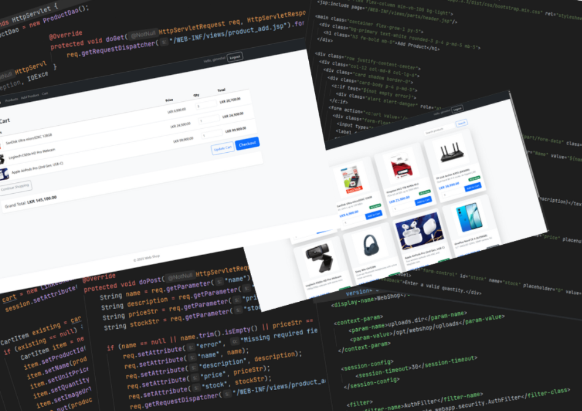

# WebShop – E‑commerce Web App
#### Video Demo: (coming soon)

## Description
WebShop is a lightweight Java e‑commerce application built with Jakarta Servlet/JSP, Hibernate ORM, and MySQL. It provides product browsing, user authentication, a shopping cart and checkout flow, and a minimal admin interface for managing products and inventory. The focus is a clear, deployable reference that favors simplicity over heavy frameworks.

---

## Technologies Used
- Java 21
- Jakarta Servlet 6 / JSP 3.1, JSTL
- Hibernate ORM 6
- MySQL 8
- Maven

---

## How to Run the Project

### 1. Clone the repo
```bash
git clone https://github.com/<your-username>/WebShop.git
cd WebShop
```

### 2. Configure the database
- Create a MySQL database (e.g., `webshop`).
- Update DB credentials/URL in your configuration (e.g., `src/main/resources/hibernate.cfg.xml` or `META-INF/persistence.xml`).
- (Optional) Import seed data if a SQL file is provided.

### 3. Build the app
```bash
mvn clean package
```

### 4A. Run with Apache Tomcat 10+
- Copy the generated WAR from `target/` (e.g., `webshop.war`) into your Tomcat `webapps/` directory.
- Start Tomcat and open:
    - http://localhost:8080/webshop/

### 4B. Run with Jetty (if available)
```bash
mvn jetty:run
# App at http://localhost:8080/
```

---

## Key Pages
| Path                 | Description                       |
|----------------------|-----------------------------------|
| `/`                  | Home / product catalog            |
| `/product?id=<id>`   | Product details                   |
| `/cart`              | Shopping cart                     |
| `/checkout`          | Checkout                          |
| `/login`, `/register`| Authentication                    |
| `/admin/products`    | Admin – product management        |

---

## Why This Project?
To present a compact, classical Java web stack for a storefront—easy to deploy, easy to read, and suitable as a base for adding real-world features like payments, order history, and admin moderation.

---

## Acknowledgments
- Jakarta EE / Servlet & JSP documentation
- Hibernate ORM documentation
- MySQL documentation
